# ScoutingReport

**An AI-powered MLB scouting and analytics platform built with Python, FastAPI, and Streamlit.**

ScoutingReport pulls live MLB data, generates Claude-powered scouting reports and game previews, and visualizes pitch location heatmaps — all in a dark, editorial-style interface.

---

## Features

- 🔍 **Player Search** — Search any active or historical MLB player
- 📊 **Career Stats** — Full career hitting/pitching trends with interactive charts
- ⚾ **AI Scouting Report** — Claude analyzes a player's season and generates a professional scouting report
- ⚔️ **Matchup Analyzer** — Head-to-head batter vs. pitcher analysis with AI breakdown
- 📅 **Today's Games** — Live schedule with pitcher heatmaps, handedness filters, head-to-head stats, and AI game previews

---

## Tech Stack

| Layer | Technology |
|---|---|
| Frontend | Streamlit, Plotly, HTML/CSS |
| Backend | FastAPI, Python |
| Database | Supabase (PostgreSQL) |
| AI | Anthropic Claude API |
| Data | MLB Stats API |

---

## Setup

### Prerequisites
- Python 3.11+
- Supabase account
- Anthropic API key

### Installation

```bash
git clone https://github.com/cameroncooper/scoutingreport.git
cd scoutingreport
python -m venv venv
source venv/bin/activate
pip install -r requirements.txt
```

### Environment Variables

Create a `.env` file in the project root:

```env
ANTHROPIC_API_KEY=your_anthropic_api_key
SUPABASE_URL=your_supabase_url
SUPABASE_KEY=your_supabase_key
```

### Running the App

**Terminal 1 — API:**
```bash
uvicorn main:app --reload
```

**Terminal 2 — Frontend:**
```bash
python -m streamlit run frontend/app.py
```

Then open [http://localhost:8501](http://localhost:8501).

---

## Project Structure

```
scoutingreport/
├── app/
│   ├── api/
│   │   ├── games.py        # Today's games, heatmaps, head-to-head
│   │   ├── players.py      # Player search, stats, info
│   │   └── scout.py        # AI scouting report generation
│   ├── core/
│   │   └── config.py       # Environment config
│   ├── db/                 # Database models & queries
│   ├── models/             # Pydantic models
│   └── services/           # MLB API integration
├── assets/
│   └── demo/               # Screenshots
├── frontend/
│   ├── app.py              # Main Streamlit app & navigation
│   └── views/
│       ├── search.py       # Player search view
│       ├── stats.py        # Career stats view
│       ├── report.py       # Scouting report view
│       ├── matchup.py      # Matchup analyzer view
│       └── today.py        # Today's games view
├── main.py                 # FastAPI entry point
└── requirements.txt
```

---

## Screenshots

### Player Search
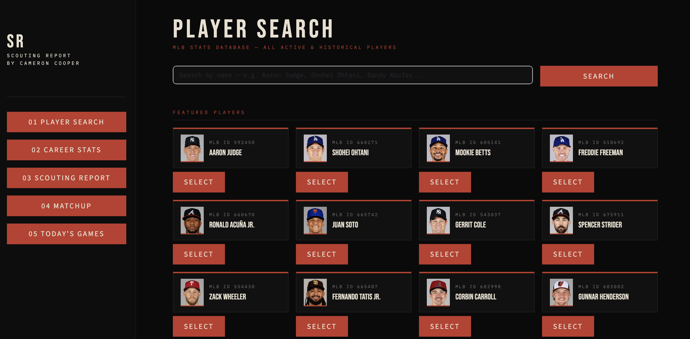

---

### Career Stats
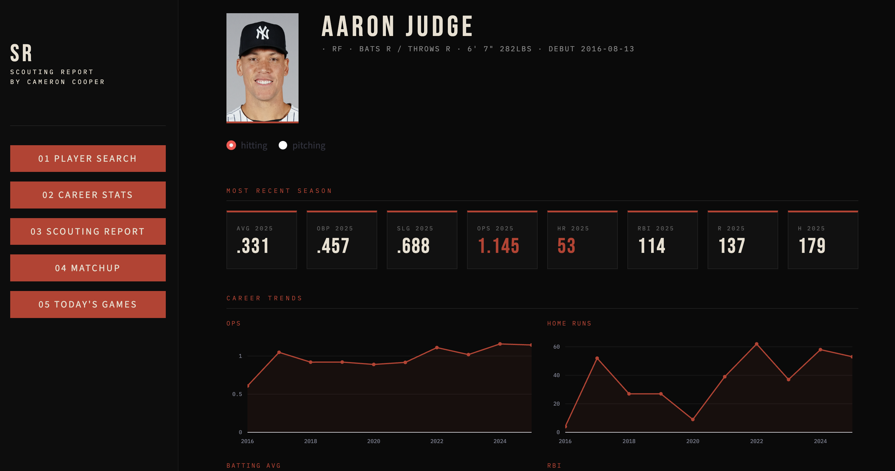
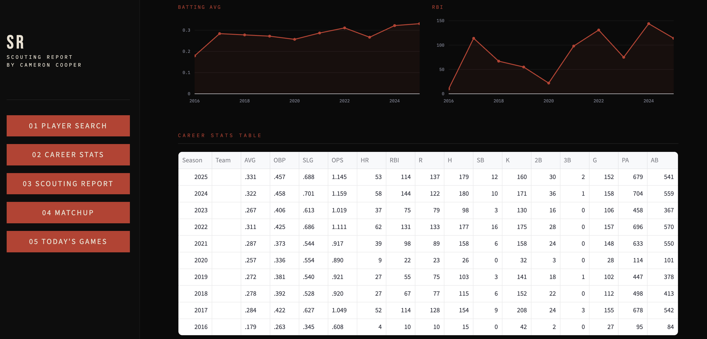

---

### AI Scouting Report
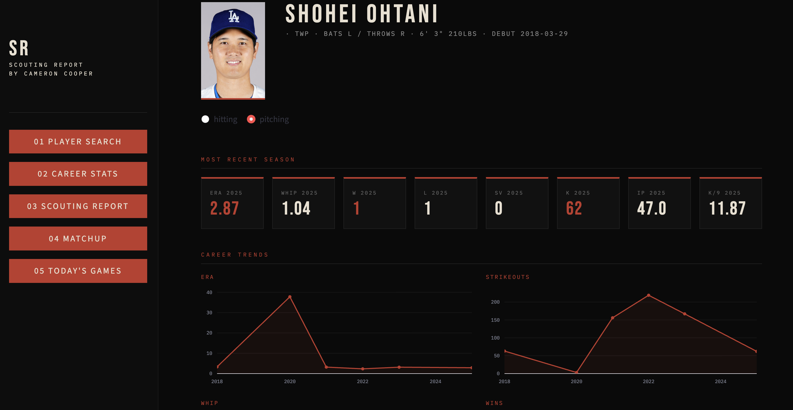
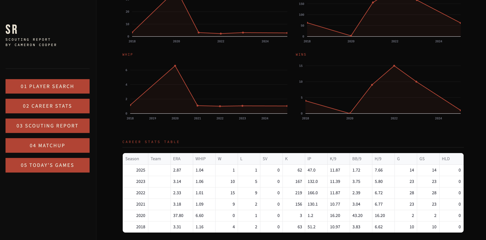

---

### Matchup Analyzer
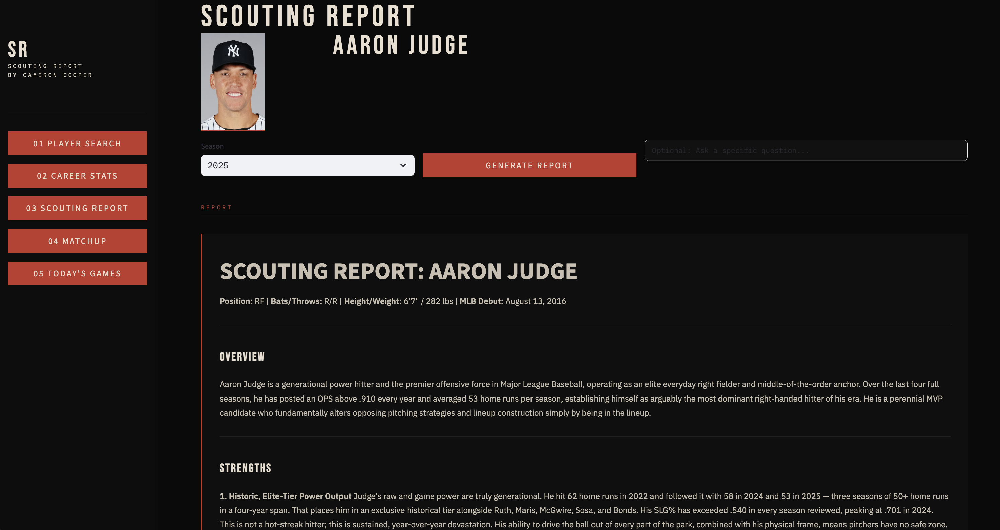
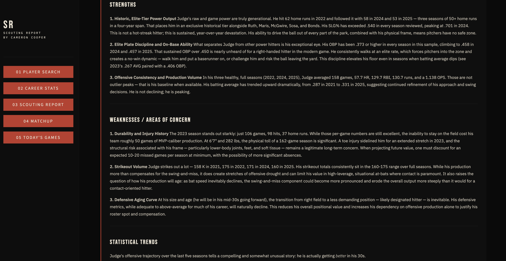
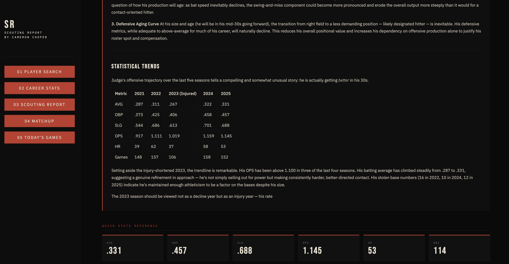

---

### Today's Games — Pitcher Heatmaps
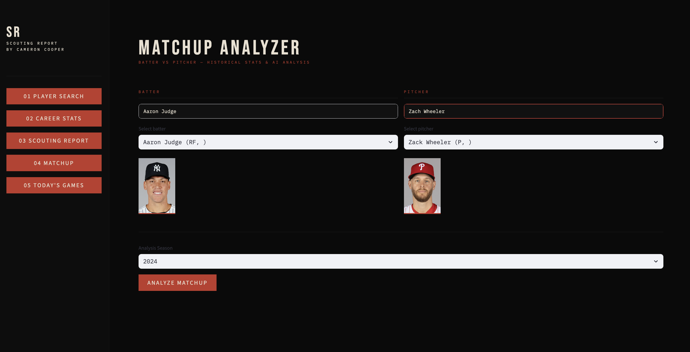
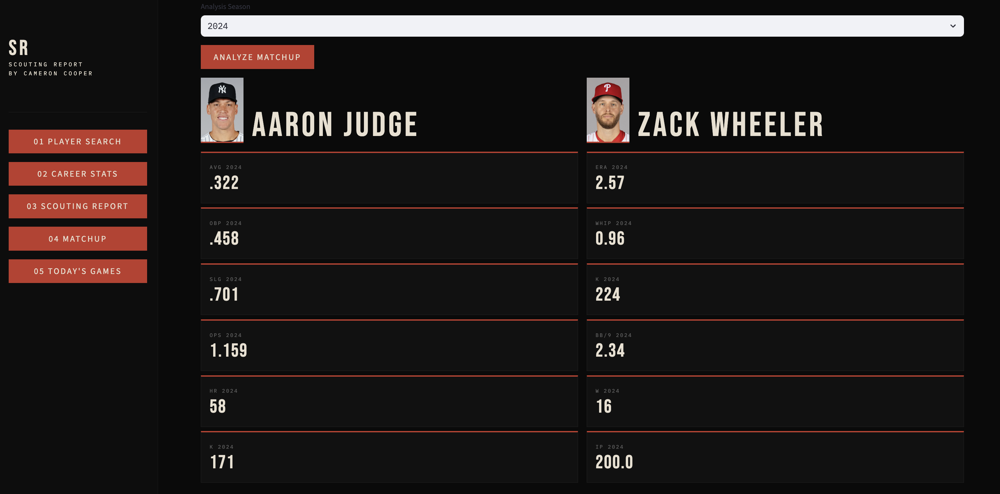
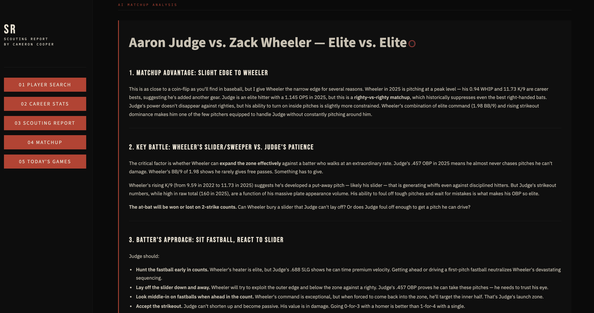
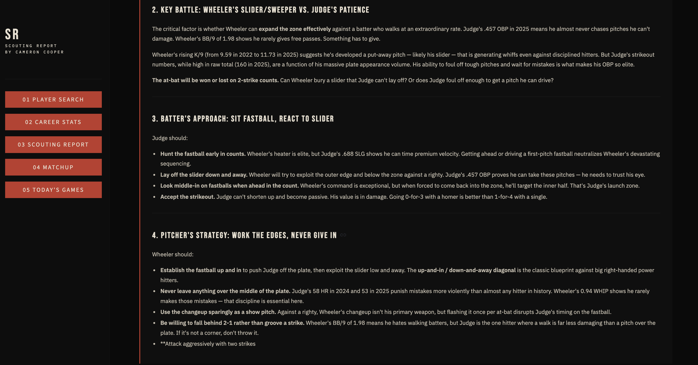

---

### AI Game Preview
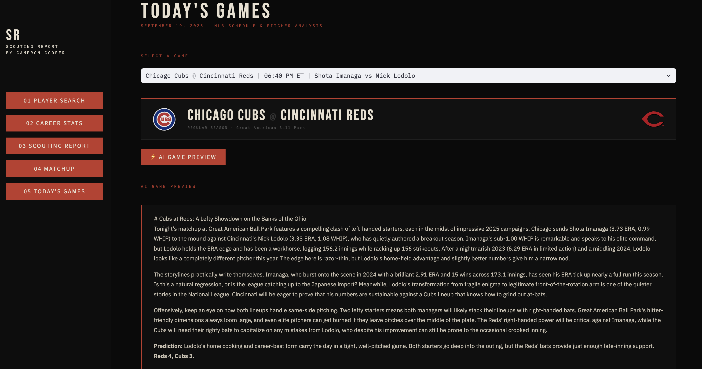
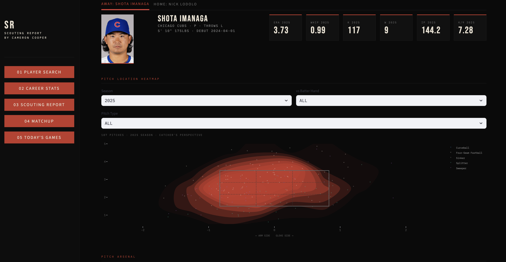
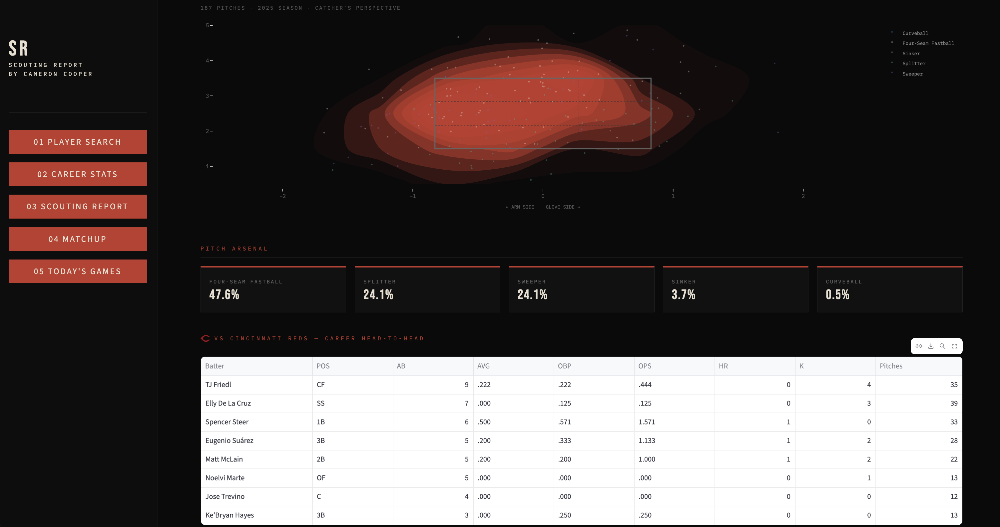

---
